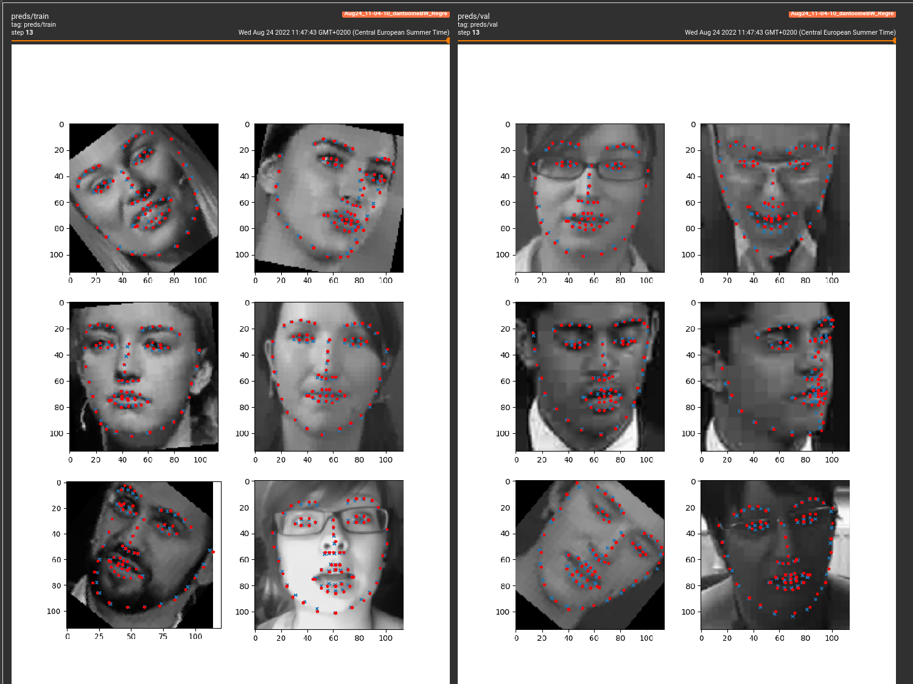

# Landmark detection models

This directory contains all the related stuff for training landmark detection models.

The main idea here is to build models that achieve reasonable results but with the constraint that they must be fast (or low FLOP).

At this moment, a direct landmark regression model is being tested. In order to reduce the number of weights a Resnet-18 backbone (without pretraining it on Imagenet) is being used on 1-channel 114x114 images.

**Example**

*(Red = Ground truth; Blue = Model preds)*




## Datasets
- **LS3D-W**: https://www.adrianbulat.com/face-alignment (you have to request access).


## Structure

```
datasets/
   - LS3D-W/         # Directly extracted from the original tar-gz
      - splits.csv   # This is the file produced by preprocessing.py
```


## Data preproc

### LS3D-W

```
python src/preprocessing.py ls3d
```


## Training

```
python src/training.py
```

You may also visualize progress with Tensorboard

```
tensorboard --logdir=runs
```


